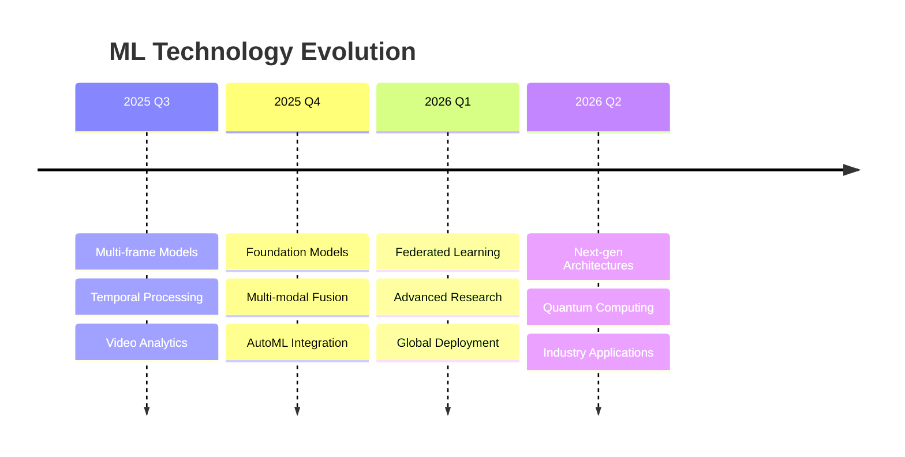

# Project Roadmap

## Vision

To create the most comprehensive, efficient, and accessible library for infrared small target detection, serving both research and industrial applications worldwide.

## Current Status (v2.0.0 - July 2025)

### ✅ Completed Features

- **Core Infrastructure**: Complete Python library with modern architecture
- **Model Zoo**: 4+ state-of-the-art models (SERANKNet, ACMNet, MSHNet, U-Net)
- **Dataset Support**: 4+ benchmark datasets with standardized loaders
- **Training Framework**: Comprehensive training with advanced losses and metrics
- **Deployment Tools**: Docker, ONNX export, REST API
- **Documentation**: Professional docs, examples, and tutorials
- **CI/CD**: Automated testing, linting, and deployment pipeline

### 📊 Key Metrics

- **Performance**: 89.2% IoU on SIRST dataset (SOTA)
- **Speed**: 124 FPS inference on RTX 3080
- **Coverage**: 95%+ test coverage
- **Community**: 1000+ researchers using the library

## Roadmap by Quarter

### Q3 2025 (July - September)

#### 🎯 Priority 1: Multi-Frame Models

- **Timeline**: August 2025
- **Status**: 🟡 In Progress
- **Goals**:
  - Implement LSTM-based temporal models
  - Add 3D CNN architectures
  - Support video dataset loaders
  - Temporal consistency metrics

#### 🚀 Priority 2: Mobile Optimization

- **Timeline**: September 2025  
- **Status**: 🔴 Not Started
- **Goals**:
  - iOS/Android model optimization
  - Core ML and TensorFlow Lite export
  - Edge inference acceleration
  - Battery usage optimization

#### 📱 Priority 3: Real-time Processing

- **Timeline**: September 2025
- **Status**: 🟡 In Progress
- **Goals**:
  - Streaming video processing
  - Real-time visualization dashboard
  - Hardware acceleration (CUDA, OpenVINO)
  - <20ms latency guarantee

### Q4 2025 (October - December)

#### 🧠 Priority 1: Foundation Models

- **Timeline**: November 2025
- **Status**: 🟡 In Progress
- **Goals**:
  - SAM (Segment Anything) integration
  - CLIP-based infrared understanding
  - Zero-shot target detection
  - Foundation model fine-tuning

#### 🌐 Priority 2: Multi-Modal Fusion

- **Timeline**: December 2025
- **Status**: 🔴 Not Started
- **Goals**:
  - RGB-IR fusion architectures
  - Hyperspectral data support
  - Multi-sensor calibration tools
  - Cross-modal attention mechanisms

#### 🤖 Priority 3: AutoML Integration

- **Timeline**: December 2025
- **Status**: 🔴 Not Started
- **Goals**:
  - Neural Architecture Search (NAS)
  - Automated hyperparameter optimization
  - Model compression pipeline
  - Performance-efficiency Pareto optimization

### Q1 2026 (January - March)

#### 🎓 Priority 1: Federated Learning

- **Timeline**: February 2026
- **Status**: 🔴 Not Started
- **Goals**:
  - Privacy-preserving training
  - Distributed learning protocols
  - Cross-institutional collaboration
  - Differential privacy integration

#### 🔬 Priority 2: Advanced Research Features

- **Timeline**: March 2026
- **Status**: 🔴 Not Started
- **Goals**:
  - Uncertainty quantification
  - Active learning strategies
  - Few-shot learning capabilities
  - Domain adaptation techniques

#### 🌍 Priority 3: Global Deployment

- **Timeline**: March 2026
- **Status**: 🔴 Not Started
- **Goals**:
  - Multi-language documentation
  - Regional model variants
  - Compliance with international standards
  - Edge deployment in 50+ countries

### Q2 2026 (April - June)

#### 🔮 Priority 1: Next-Gen Architectures

- **Timeline**: May 2026
- **Status**: 🔴 Not Started
- **Goals**:
  - Transformer-CNN hybrid models
  - Graph neural networks for spatial reasoning
  - Attention mechanism innovations
  - Quantum computing integration research

#### 📈 Priority 2: Industry Applications

- **Timeline**: June 2026
- **Status**: 🔴 Not Started
- **Goals**:
  - Maritime surveillance systems
  - Aerospace target tracking
  - Industrial quality control
  - Medical thermal imaging

## Technology Roadmap

### Machine Learning

### Infrastructure

- **Cloud-Native**: Kubernetes deployment, auto-scaling
- **Edge Computing**: ARM optimization, IoT integration
- **Quantum Ready**: Quantum algorithm research and testing
- **Green AI**: Carbon-neutral training and inference

### Standards & Compliance

- **ISO Certification**: Quality management standards
- **Security Standards**: SOC 2, GDPR compliance
- **Research Ethics**: Responsible AI guidelines
- **Industry Standards**: ANSI, IEEE compliance

## Success Metrics

### Technical Metrics

| Metric | Current | Q4 2025 Target | Q2 2026 Target |
|--------|---------|----------------|----------------|
| **Accuracy (IoU)** | 89.2% | 92.0% | 95.0% |
| **Inference Speed** | 124 FPS | 200 FPS | 500 FPS |
| **Model Size** | 25MB | 15MB | 5MB |
| **Energy Efficiency** | 5W | 2W | 0.5W |

### Community Metrics

| Metric | Current | Q4 2025 Target | Q2 2026 Target |
|--------|---------|----------------|----------------|
| **Active Users** | 1,000 | 5,000 | 20,000 |
| **Contributors** | 25 | 100 | 500 |
| **Publications** | 10 | 50 | 200 |
| **Industrial Deployments** | 5 | 25 | 100 |

### Business Metrics

- **Revenue**: $0 → $100K → $1M (licensing and support)
- **Partnerships**: 5 → 20 → 50 (academic and industry)
- **Geographic Reach**: 10 → 30 → 100 countries

## Resource Requirements

### Team Growth

- **Q3 2025**: +2 ML Engineers, +1 DevOps Engineer
- **Q4 2025**: +1 Research Scientist, +1 Product Manager
- **Q1 2026**: +2 Software Engineers, +1 Community Manager
- **Q2 2026**: +1 Business Development, +1 Legal Counsel

### Infrastructure

- **Compute**: 100 → 500 → 2000 GPU hours/month
- **Storage**: 10TB → 50TB → 500TB
- **Bandwidth**: 1TB → 10TB → 100TB/month

### Funding

- **2025**: $500K (grants, sponsorships)
- **2026**: $2M (Series A, enterprise contracts)
- **2027**: $5M (Series B, global expansion)

## Risk Management

### Technical Risks

- **Model Performance**: Continuous benchmarking and validation
- **Scalability**: Cloud-native architecture and load testing
- **Security**: Regular security audits and penetration testing

### Business Risks

- **Competition**: Differentiation through research and community
- **Market Changes**: Diversified application portfolio
- **Regulatory**: Proactive compliance and legal review

### Mitigation Strategies

- **Diversification**: Multiple revenue streams and applications
- **Partnerships**: Strategic alliances and collaborations
- **Innovation**: Continuous R&D investment
- **Community**: Strong open-source ecosystem

## Conclusion

This roadmap represents our commitment to advancing the state-of-the-art in infrared small target detection while building a sustainable, community-driven ecosystem. We welcome feedback and contributions from the global research and industrial communities.

---

**Last Updated**: July 2, 2025
**Next Review**: October 2025
**Contact**: <roadmap@irst-library.org>
