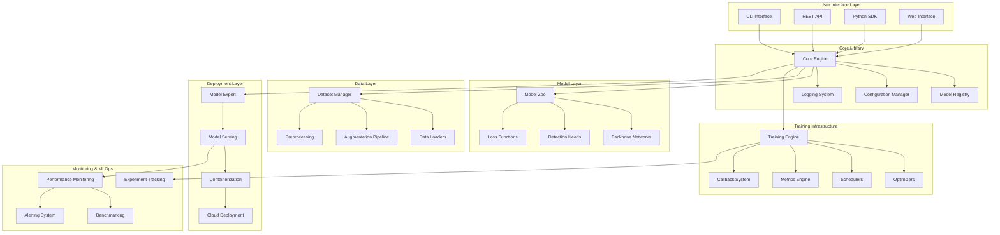
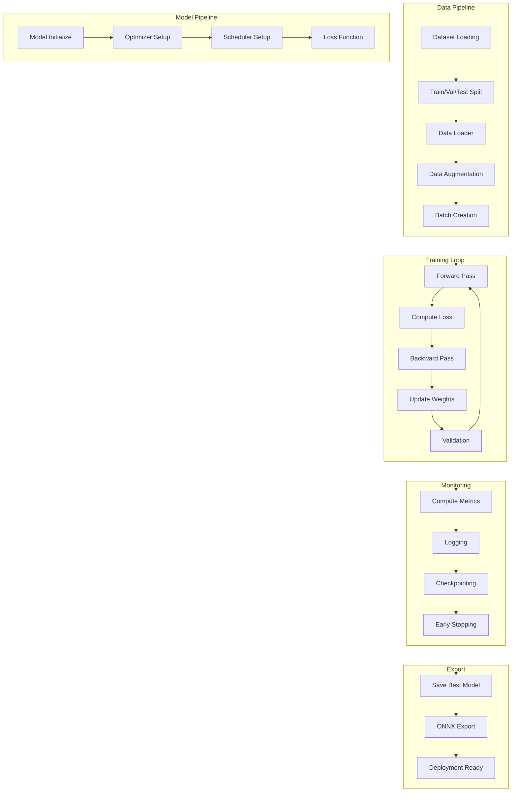
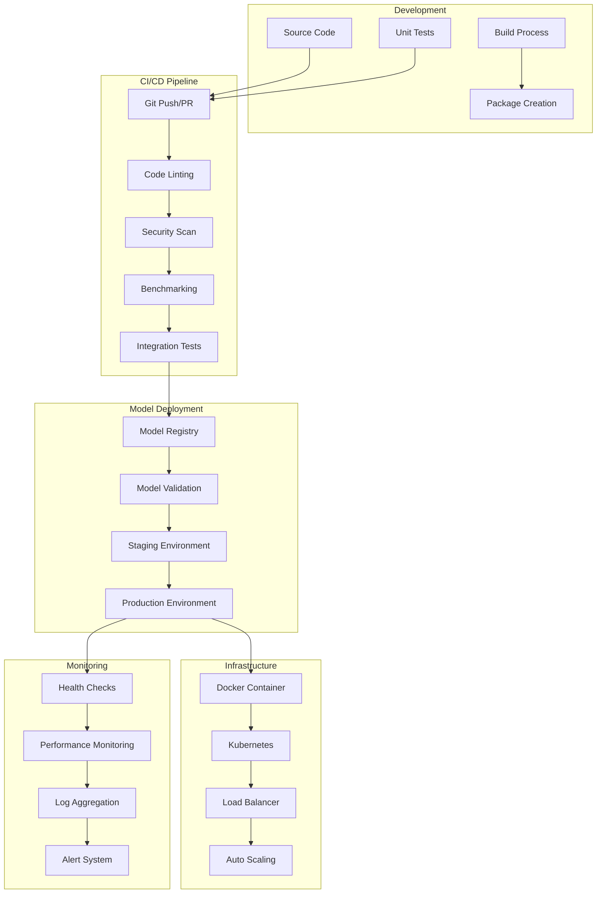
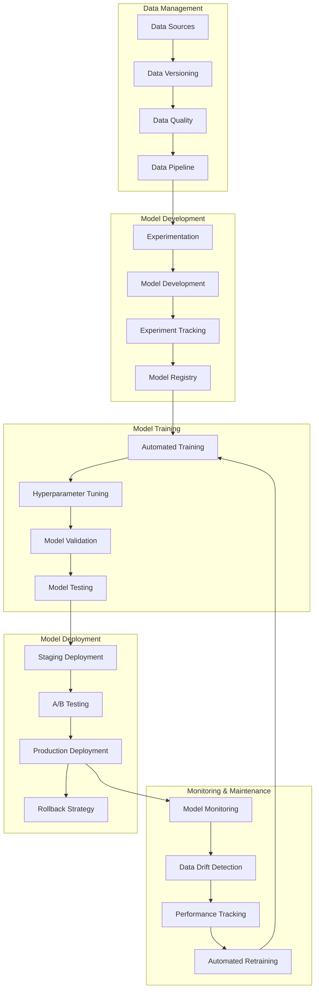
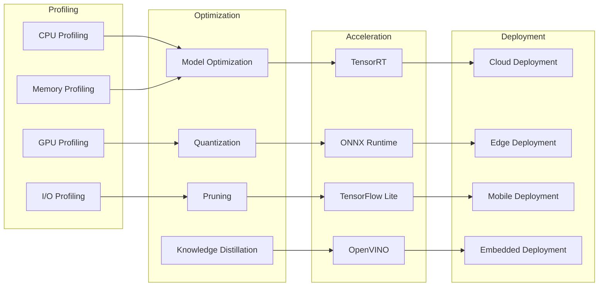
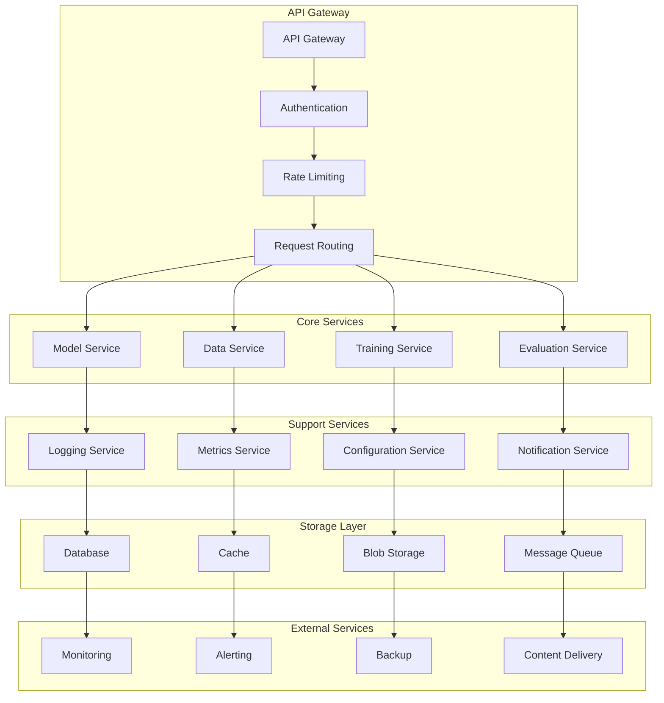

# IRST Library Architecture Documentation

This document provides comprehensive architectural diagrams and flows for the IRST Library.

## System Architecture Overview

## Model Architecture Flow

```mermaid
graph LR
    subgraph "Input Processing"
        IMG[Input Image<br/>H×W×C]
        NORM[Normalization]
        AUG[Augmentation]
        PREP[Preprocessing]
    end
    
    subgraph "Feature Extraction"
        CONV1[Conv Block 1<br/>64 channels]
        CONV2[Conv Block 2<br/>128 channels]
        CONV3[Conv Block 3<br/>256 channels]
        CONV4[Conv Block 4<br/>512 channels]
    end
    
    subgraph "Multi-Scale Processing"
        FPN[Feature Pyramid Network]
        ATTENTION[Attention Module]
        FUSION[Feature Fusion]
    end
    
    subgraph "Detection Head"
        CLASSIFIER[Classification Head]
        SEGMENTATION[Segmentation Head]
        LOCALIZATION[Localization Head]
    end
    
    subgraph "Post-Processing"
        NMS[Non-Max Suppression]
        THRESHOLD[Thresholding]
        FILTER[Filtering]
    end
    
    subgraph "Output"
        BBOX[Bounding Boxes]
        MASK[Segmentation Mask]
        CONF[Confidence Scores]
    end
    
    IMG --> NORM
    NORM --> AUG
    AUG --> PREP
    
    PREP --> CONV1
    CONV1 --> CONV2
    CONV2 --> CONV3
    CONV3 --> CONV4
    
    CONV1 --> FPN
    CONV2 --> FPN
    CONV3 --> FPN
    CONV4 --> FPN
    
    FPN --> ATTENTION
    ATTENTION --> FUSION
    
    FUSION --> CLASSIFIER
    FUSION --> SEGMENTATION
    FUSION --> LOCALIZATION
    
    CLASSIFIER --> NMS
    SEGMENTATION --> THRESHOLD
    LOCALIZATION --> FILTER
    
    NMS --> BBOX
    THRESHOLD --> MASK
    FILTER --> CONF
```

## Training Pipeline Flow

## Deployment Architecture

## Data Flow Architecture

```mermaid
graph LR
    subgraph "Data Sources"
        RAW[Raw Images]
        ANNOTATED[Annotated Data]
        SYNTHETIC[Synthetic Data]
        EXTERNAL[External Datasets]
    end
    
    subgraph "Data Processing"
        INGEST[Data Ingestion]
        VALIDATE[Data Validation]
        CLEAN[Data Cleaning]
        TRANSFORM[Data Transformation]
    end
    
    subgraph "Data Storage"
        LAKE[Data Lake]
        WAREHOUSE[Data Warehouse]
        CACHE[Cache Layer]
        REGISTRY[Dataset Registry]
    end
    
    subgraph "Feature Engineering"
        EXTRACT[Feature Extraction]
        SELECT[Feature Selection]
        ENGINEER[Feature Engineering]
        STORE[Feature Store]
    end
    
    subgraph "Model Training"
        SPLIT[Data Splitting]
        LOAD[Data Loading]
        AUGMENT[Data Augmentation]
        TRAIN[Model Training]
    end
    
    RAW --> INGEST
    ANNOTATED --> INGEST
    SYNTHETIC --> INGEST
    EXTERNAL --> INGEST
    
    INGEST --> VALIDATE
    VALIDATE --> CLEAN
    CLEAN --> TRANSFORM
    
    TRANSFORM --> LAKE
    LAKE --> WAREHOUSE
    WAREHOUSE --> CACHE
    CACHE --> REGISTRY
    
    REGISTRY --> EXTRACT
    EXTRACT --> SELECT
    SELECT --> ENGINEER
    ENGINEER --> STORE
    
    STORE --> SPLIT
    SPLIT --> LOAD
    LOAD --> AUGMENT
    AUGMENT --> TRAIN
```

## MLOps Workflow

## Security Architecture

```mermaid
graph TB
    subgraph "Authentication & Authorization"
        AUTH[Authentication Service]
        RBAC[Role-Based Access Control]
        JWT[JWT Tokens]
        MFA[Multi-Factor Authentication]
    end
    
    subgraph "Data Security"
        ENCRYPT[Data Encryption]
        MASK[Data Masking]
        AUDIT[Audit Logging]
        BACKUP[Secure Backup]
    end
    
    subgraph "Model Security"
        SIGN[Model Signing]
        VERIFY[Model Verification]
        SCAN[Security Scanning]
        ISOLATION[Model Isolation]
    end
    
    subgraph "Infrastructure Security"
        FIREWALL[Firewall Rules]
        VPN[VPN Access]
        MONITOR[Security Monitoring]
        INCIDENT[Incident Response]
    end
    
    subgraph "Compliance"
        GDPR[GDPR Compliance]
        SOC[SOC 2 Compliance]
        HIPAA[HIPAA Compliance]
        REPORT[Compliance Reporting]
    end
    
    AUTH --> RBAC
    RBAC --> JWT
    JWT --> MFA
    
    ENCRYPT --> MASK
    MASK --> AUDIT
    AUDIT --> BACKUP
    
    SIGN --> VERIFY
    VERIFY --> SCAN
    SCAN --> ISOLATION
    
    FIREWALL --> VPN
    VPN --> MONITOR
    MONITOR --> INCIDENT
    
    GDPR --> SOC
    SOC --> HIPAA
    HIPAA --> REPORT
```

## Performance Optimization Flow

## Microservices Architecture

